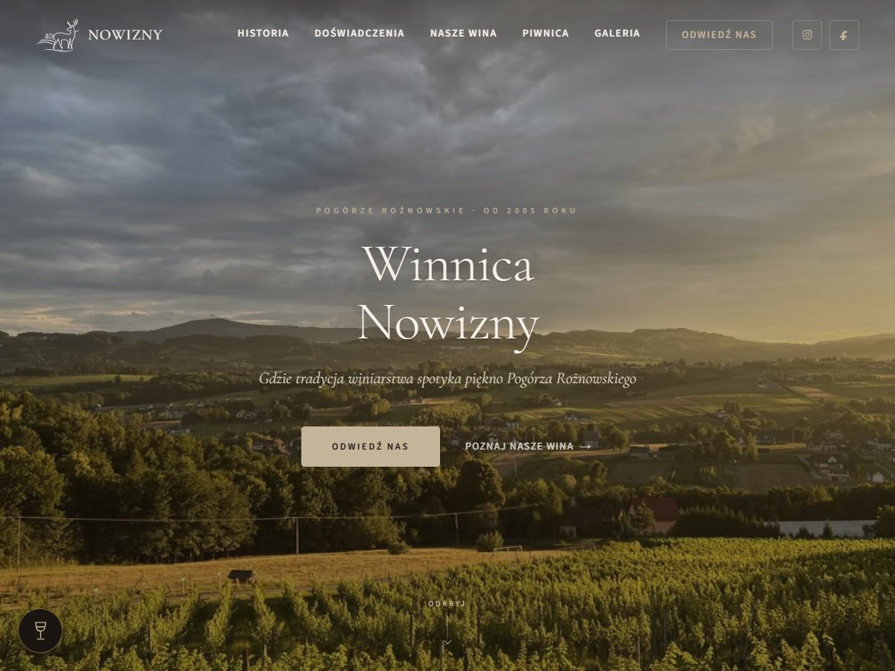

# Winnica Nowizny

Strona wizytówka rodzinnej winnicy na Pogórzu Rożnowskim. Jedna strona z sekcjami
o historii gospodarstwa, oferowanych doświadczeniach, winach, piwnicy z 1891 roku,
galerii i formularzem rezerwacji wizyty. Nie jest to sklep: wina są prezentowane,
ale nie sprzedawane online.

Repozytorium zawiera własny motyw WordPress razem z całym środowiskiem: lokalnym
stosem Docker, obrazem produkcyjnym, skryptami instalacyjnymi i migracyjnymi.



## Stack

- WordPress 7.0 jako Classic Theme, PHP 8.2
- Timber 2.5 i Twig 3 na warstwę szablonów
- Advanced Custom Fields 6.8 (wersja darmowa, synchronizacja przez `acf-json`)
- Vite 6 do budowania CSS i JavaScriptu
- MariaDB 11, Apache, wszystko w Dockerze

Wersja ACF jest przypięta w `Dockerfile.wordpress`, a Timber i Twig w
`composer.lock`, żeby obraz produkcyjny budował się powtarzalnie.

## Uruchomienie lokalne

Potrzebny jest Docker i plik `.env` utworzony na podstawie `.env.example`. Bez
haseł w `.env` compose przerwie start z komunikatem, która zmienna jest pusta.

```bash
docker compose up -d
docker run --rm -v "$PWD/wp-theme/winnica-nowizny:/app" -w /app composer:2.8 install
docker compose run --rm wpcli sh /setup/install.sh
docker compose run --rm wpcli sh /setup/seed-homepage.sh
```

Strona stanie na `http://localhost:8080`. Instalator zakłada stronę główną,
politykę prywatności, pięć prezentowanych win i menu. Hasło administratora bierze
z `WP_ADMIN_PASSWORD`, a jeśli zmienna jest pusta, generuje je jednorazowo i
wypisuje na końcu.

Frontend buduje się osobno:

```bash
cd wp-theme/winnica-nowizny
npm ci
npm run build
```

Skompilowane pliki lądują w `assets/dist` i są śledzone przez Gita, więc serwer
docelowy nie potrzebuje Node. Motyw czyta manifest Vite i odmawia załadowania
niekompletnego builda.

## Co jest w środku

**Treść w panelu.** Wszystkie teksty, zdjęcia i opinie siedzą w polach ACF
przypiętych do strony głównej. Wina są osobnym typem wpisu (`wino`) z własnym
zestawem pól. Definicje grup leżą w `acf-json` i synchronizują się automatycznie.

**Formularz kontaktowy.** Własna obsługa w `inc/contact-form.php`, bez wtyczki.
Nonce, honeypot, token czasowy podpisany HMAC i dwa limity liczone po
zahashowanym adresie IP: cztery przyjęte zgłoszenia na kwadrans oraz dwadzieścia
żądań na kwadrans niezależnie od tego, czy przeszły walidację. Ten drugi jest
po to, żeby odrzucone zgłoszenia, które też zapisują transient, nie były darmowe.
Wiadomości zapisują się jako wpisy, a wysyłka idzie przez SMTP skonfigurowany
zmiennymi środowiskowymi.

**Bez analityki i bez cookies.** Strona nie ładuje Google Analytics ani żadnego
innego narzędzia śledzącego, więc nie ma panelu zgód. Jedyna usługa zewnętrzna to
osadzona mapa Google w sekcji dojazdu, opisana w polityce prywatności. Fonty są
serwowane z motywu, a nie z fonts.googleapis.com.

**SEO.** Motyw sam generuje tytuły, opisy, canonicale, Open Graph i dane
strukturalne schema.org typu `LocalBusiness` z rozszerzeniem `Winery`. Godziny
otwarcia idą jako cztery okresy z `validFrom` i `validThrough`, bo harmonogram
letni nakłada się na resztę roku w soboty i nie da się go podać jedną listą.

**Wydajność.** Strona główna cache'uje się w transiencie na godzinę i unieważnia
przy zmianie motywu, menu, ustawień w Customizerze oraz przy zapisie strony,
wina albo załącznika. Wiadomość z formularza cache'u nie rusza, bo nie zmienia
niczego na stronie publicznej. Zdjęcia mają warianty AVIF i WebP z
`srcset`, fonty są hostowane lokalnie, a te potrzebne do pierwszego renderu
dostają `preload`.

**Bezpieczeństwo.** Ukryta wersja WordPressa, ogólny komunikat błędu logowania,
limit prób logowania, wyłączony XML-RPC. Adres klienta bierze się z nagłówków
przekierowań tylko wtedy, gdy żądanie przyszło z zakresu wpisanego w
`WINNICA_TRUSTED_PROXY_CIDRS`, więc limitów nie da się obejść podrobionym
`X-Forwarded-For`. Apache i PHP nie zdradzają wersji i nie serwują plików `.log`,
`.sql`, `.bak` ani kropkowych.

**Monitoring.** Endpoint `/wp-json/winnica/v1/health` zwraca 200 albo 503 razem z
lakonicznym statusem. Korzysta z niego healthcheck kontenera i workflow w
`.github/workflows`, na razie wyłączony z harmonogramu do czasu wdrożenia.

## Struktura

```
wp-theme/winnica-nowizny/   motyw: PHP, szablony Twig, źródła CSS i JS, obrazy
├── inc/                    logika podzielona na moduły ładowane z functions.php
├── templates/partials/     sekcje strony głównej, jedna sekcja na plik
├── acf-json/               definicje pól ACF pod kontrolą wersji
└── src/                    źródła przed budowaniem przez Vite
setup/                      instalacja, seed treści, migracja, backup, hardening
scripts/                    przygotowanie zdjęć i zasobów produkcyjnych
```

## Wdrożenie

Docelowo strona stoi na hostingu współdzielonym z PHP 8.2, SSH i WP-CLI. Docker
jest środowiskiem lokalnym: na serwerze WordPress instaluje się z panelu, a motyw
jedzie przez SFTP razem z `vendor/` i `assets/dist`, bo pierwsze jest w
`.gitignore`, a drugie warunkuje start motywu.

Po imporcie bazy `setup/migrate-production.sh` podmienia adres lokalny na
produkcyjny i czyści cache; działa zarówno w kontenerze, jak i przez SSH.
Reguły serwera, których nie da się wgrać do konfiguracji Apache na hostingu
współdzielonym, czekają gotowe w `setup/htaccess-production.txt`.

`Dockerfile.wordpress` i `docker-compose.production.yml` zostają w repozytorium
na wypadek przeniesienia na VPS, ale obecna procedura wdrożenia ich nie używa.

Pełna instrukcja krok po kroku znajduje się w [setup/SETUP.md](setup/SETUP.md).

## Uwagi

Timber 2 jest zależnością motywu instalowaną przez Composer. Nie instaluj starej
wtyczki `timber-library`; jest nieutrzymywana i koliduje z wersją z `vendor/`.
